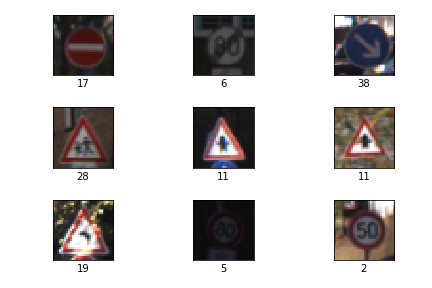
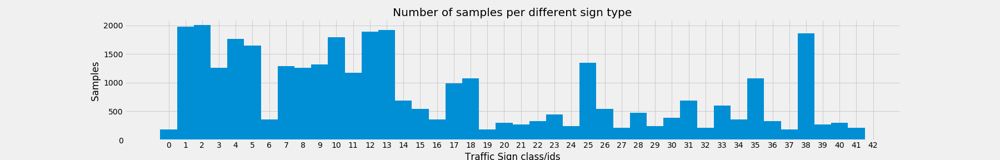

# Convolutional Neural Networks for Traffic Sign Classification

---

This repository contains the code and data necessary to train a CNN to classify 43 different categories of traffic signs. 

---
### The Data

The training data for this project comes from the [German Traffic Sign Dataset](http://benchmark.ini.rub.de/?section=gtsrb&subsection=dataset). The notebook will automatically fetch this data and it is not directly included in the repository.  

<figure>

<figcaption>Fig1. - Example traffic signs.</figcaption>
</figure>

  

The images are **32x32** and depict one of **43** different classes of signs. The images come split into **34,799** training images and **12,630** test images. There is some class imbalance. The training/validation split is stratified to help with this.

<figure>

<figcaption>Fig2. - Distribution of sign classes.</figcaption>
</figure>

  

### Parameters

**Epochs**: 150  
**Batch size**: 128  
**Learning rate**: 0.001  
**Truncated normal mean**: 0.0  
**Truncated normal standard deviation**: 0.1  
**Dropout keep rate**: 0.5  
**L2 regularization strength**: 1E-6  
**Loss optimization algorithm**: Adam  

---
#Traffic Sign Deep Learning Project
